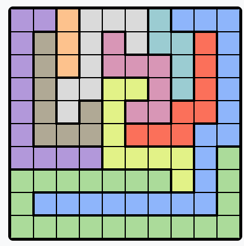
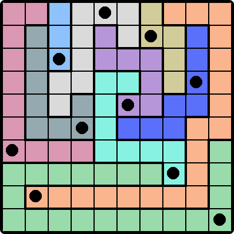

# Linkedin Games Solvers

Brute force solver for Queens. Takes in a screenshot for any puzzle and spits out the screenshot with the solution cells marked.

Zip and Tango will be coming soon. 

# How to run

1. Clone repo and run `pip install -r pyproject.toml` (Assuming you have Python 3)
2. Take a screenshot of the unsolved puzzle today (whitespace around the grid is fine, but I haven't tested this with other noise surrounding the grid).
3. Put this screenshot in the `queens` directory.
4. Run `python queens_solver.py` with the file name of your screenshot. 
5. The solution will show up under `queens/solutions`.

# Example
Input

Output

